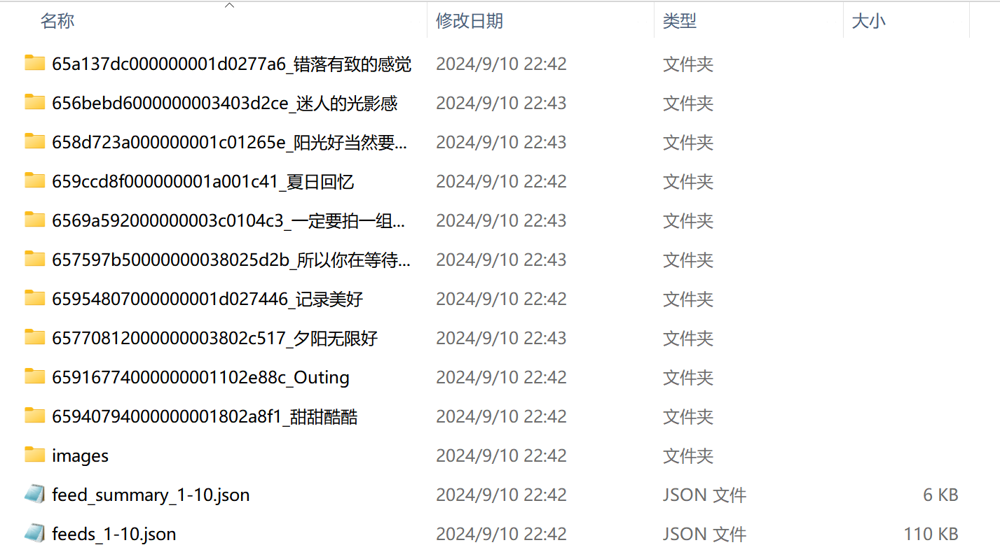
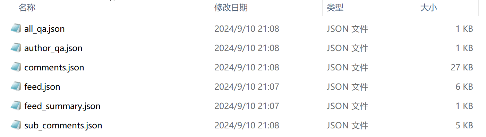

# 小红书数据采集工具


## 项目概述

强大的小红书数据采集工具：全面爬取笔记、主页、搜索结果及评论；x-s参数逆向；批量下载图片；深度采集评论、QA对及作者互动。高效稳定，反爬能力强。专为数据分析师、市场研究人员和内容创作者打造，助您洞悉小红书平台动态。#小红书爬虫 #数据挖掘


## 🚀 核心优势

- 🌐 **全面数据采集**：一站式获取用户笔记、图片、评论及QA对
- 🔐 **稳定可靠**：x-s参数逆向技术，确保采集稳定性
- 🔍 **深度数据挖掘**：自动提取评论中的QA对及作者相关互动
- 🖼️ **海量资源**：高效批量下载图片
- 🛠️ **灵活可定制**：接口化设计，易于扩展和二次开发
- ⚡ **JavaScript实现**：高效的web开发和数据处理能力


## 🌟 为什么选择本项目？

1. **个人定制服务**：由经验丰富的开发者提供及时的技术支持
2. **持续更新**：密切关注小红书平台变化，及时更新接口
3. **高性能**：优化的JavaScript实现，提供更快的数据获取速度
4. **安全可靠**：采用先进的反检测技术，降低封号风险
5. **灵活定价**：根据您的需求提供定制化的价格方案


## 📊数据展示

### 1. 处理后的所有用户


### 2. 某个用户所有的笔记



### 3. 某个用户的所有笔记的图片


### 4. 某个笔记具体的内容



### 5. 提取某个笔记评论的QA问答

`all_qa.json`：所有QA评论

```
[
    {
        "question": "真好看",
        "answer": "谢谢[害羞R]",
        "questionUser": "听音的二档",
        "answerUser": "闪耀萱萱"
    },
    {
        "question": "喜欢",
        "answer": "谢谢[害羞R]",
        "questionUser": "马克维",
        "answerUser": "闪耀萱萱"
    },
    {
        "question": "好看，图一好像合成的",
        "answer": "因为就是那个母体",
        "questionUser": "35mm定焦拍照的Micronsw",
        "answerUser": "早上七点睡"
    }
]
```


`author_qa.json`：与作者有关的评论

```
[
    {
        "question": "真好看",
        "answer": "谢谢[害羞R]",
        "questionUser": "听音的二档",
        "answerUser": "闪耀萱萱"
    },
    {
        "question": "喜欢",
        "answer": "谢谢[害羞R]",
        "questionUser": "马克维",
        "answerUser": "闪耀萱萱"
    }
]
```


## 🛠️ 核心功能

1. **用户笔记采集**
   - 根据收藏的用户爬取所有笔记
   - 下载笔记中的所有图片
2. **评论数据分析**
   - 爬取所有笔记的评论
   - 智能提取评论中的QA对
   - 识别并提取与作者相关的QA对
3. **整套Pipeline服务**
   - 一键启动整个数据采集流程
   - 只需运行 `node pipeline.js` 即可完成全部任务


## 💼 定制化服务

作者提供针对您特定需求的API定制服务，包括但不限于：

- 特定数据字段的定向爬取
- 自定义数据处理逻辑
- 特殊格式的数据输出
- 更多满足您独特需求的功能

每个API都附带详细文档和技术支持，确保您能够轻松集成和使用。


## 📈 数据输出格式

- 标准JSON格式，与小红书API的原始返回保持一致
- 便于进行后续的数据处理和分析
- 可根据需求提供定制化的数据结构


## ⚠️ 使用须知

- 请严格遵守小红书平台的使用条款和政策
- 建议合理控制请求频率，避免对您的账号造成影响
- 获取的数据仅限个人学习和研究使用，请勿用于商业用途


## 📞 联系与支持

如果您有任何问题或需求，欢迎联系作者：

- 微信：

- 邮箱：[2653325469@qq.com](mailto:2653325469@qq.com)

在联系作者之前，建议先查阅我们的[常见问题解答](https://github.com/SongChaotian/xhs-spider/assert/faq.md)，可能会为您节省宝贵的时间。


## 🎯 开始使用

1. 明确您的需求（单个API或整套pipeline）
2. 联系作者讨论细节和获取报价
3. 完成支付流程
4. 获取源代码和使用说明
5. 开始您的小红书数据采集之旅！


## 免责声明

本项目及相关API仅供学习和研究使用。使用者应自行承担使用本服务的所有风险和法律责任。作者不对任何由使用本服务造成的损失或问题负责。

------

💡 准备好提升您的小红书数据分析能力了吗？立即联系作者，获取专业的API服务！
